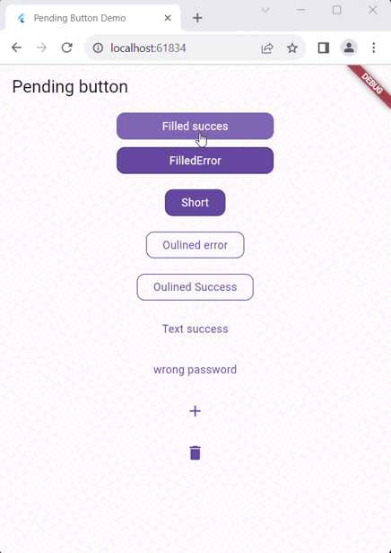

# Pending Button

Button pending is a basic Button indicate the different state of the asynchronous action. Give the user feedback on the loading status as well as the result of the action.



## Installation

Add `pending_button` to your `pubspec.yaml` as a dependacy

```yaml
dependencies: pending_button:0.0.6
```

## Usage

Import the package

```dart
import 'package:pending_button/pending_button.dart';
```

Add the PendingButton widget and pass the asynchronous function without waiting for the future

```dart
...
PendingButton(
    asynFunction: myFunction,
    child: const Text('Save'),
),
...

Future<bool> myFunction() =>
    Future.delayed(const Duration(seconds: 2)).then(
        (value) {
          return true;
        },
    );
```

Different type of button is supporeted

- PendingButton
- PendingButton.outlined
- PendingButton.text
- PendingButton.icon

### Error Handling

To show snackbar or toast when error occurred use `onError` method.

```dart
...
PendingButton(
    asynFunction: myFunction,
    onError: (Exception error) {
        ScaffoldMessenger.of(context).showSnackBar(
            SnackBar(
                content: Text(error.toString()),
            ),
        );
    },
    child: Text('Authentificate'),
),
...

Future<void> myFunction() =>
    Future.delayed(const Duration(seconds: 2)).then(
        (value) {
            throw Exception('Authentification fail');
        },
    );
```

### Success reponse

`onSuccess` method return the response data from the future

```dart
PendingButton(
    asynFunction: myFunction,
    onSuccess: (result) {
        debugPrint(result.toString());
    },
    child: Text('Authentificate'),
),
```

### Before action

the `beforeFunction` can be used to check a condition before fire the main function. It should return boolean.

```dart
PendingButton(
    asynFunction: myFunction,
    beforeFunction: () {
        if (passsword.lenght<8) return false;
        if (login.isEmpty) return false;
        return true;
    }
    child: Text('Authentificate'),
),
```

### Decortaion (Optinal)

|                   | Default               | standard | Outline | Text   | Icon |
| ----------------- | --------------------- | -------- | ------- | ------ | ---- |
| child             | -                     | Widget   | Widget  | Widget | Icon |
| width             | widget width          | ✅       | ✅      | ✅     | ✅   |
| height            | widget height         | ✅       | ✅      | ✅     | ✅   |
| backgroundColor   | Primary color         | ✅       | ⛔      | ⛔     | ⛔   |
| foregroundColor   | onPrimary             | ✅       | ✅      | ✅     | ⛔   |
| successColor      | Green                 | ✅       | ✅      | ✅     | ✅   |
| errorColor        | Error color           | ✅       | ✅      | ✅     | ✅   |
| borderColor       | background or pirmary | ✅       | ✅      | ⛔     | ⛔   |
| borderRadius      | 10.0                  | ✅       | ✅      | ⛔     | ⛔   |
| animationDuration | 200 milliseconds      | ✅       | ✅      | ✅     | ✅   |

## Principle

Inspired from Riverpod [doc](https://riverpod.dev/docs/essentials/side_effects#going-further-showing-a-spinner--error-handling)

```dart
Future<void>? pending;

Widget build(BuildContext context) {
    return FutureBuilder(
        future: pending,
        builder: (context, snapshot) {
            if (snapshot.hasError && snapshot.connectionState != ConnectionState.waiting) {
                widget.onError(snapshot.error);
                 setState(() {
                    pending = null;
                });
            }else if (snapshot.connectionState ==  ConnectionState.done){
                widget.onSuccess(snapshot.data);
                 setState(() {
                    pending = null;
                });
            }
            return AnimatedWidget(
                onPressed:(){
                    final future = widget.asynFunction();
                    setState(() {
                        pending = future;
                    });
                }
                ...
            );
        }
    );
}

```

## Real example

For a real example please check authentification example: https://github.com/MoezAyadiDev/pending_button/blob/main/example/lib/main_auth.dart

## Contributing

Pull requests are welcome. For major changes, please open an issue first
to discuss what you would like to change.

## License

[MIT](https://choosealicense.com/licenses/mit/)
